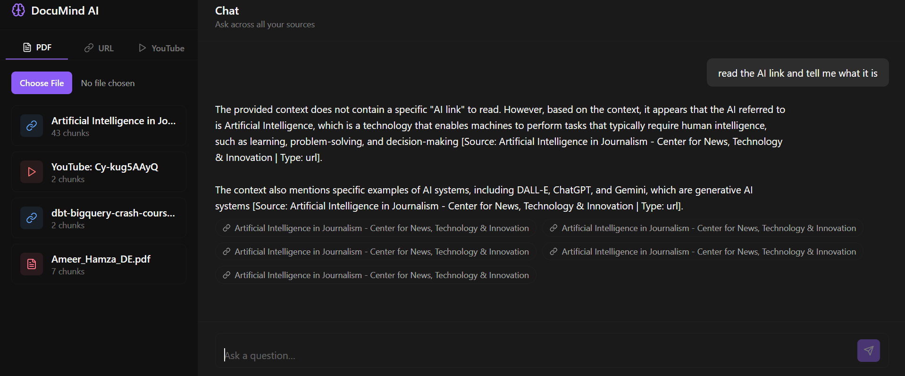
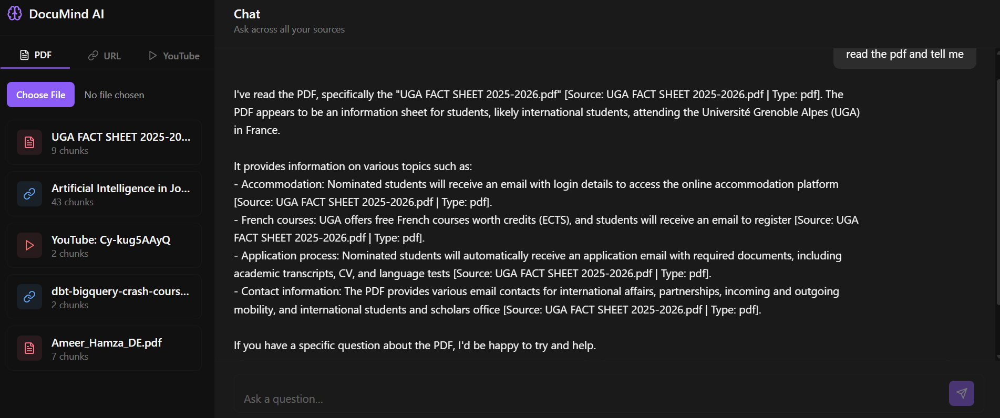
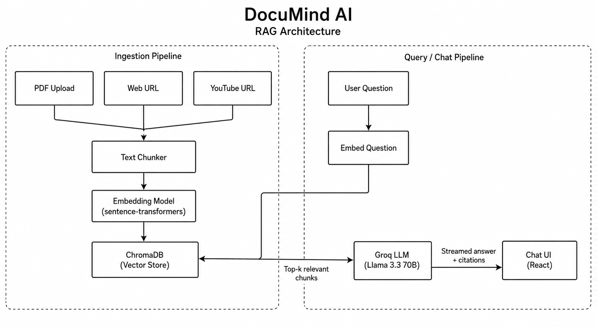

<div align="center">

# 🧠 DocuMind AI

### A multi-source RAG research assistant — chat with your PDFs, web pages, and YouTube videos in one place


</div>

---

## Overview

**DocuMind AI** is a full-stack Retrieval-Augmented Generation (RAG) application that lets you build a personal knowledge base out of three completely different source types — **PDF documents**, **web pages**, and **YouTube videos** — and then chat with an LLM that retrieves relevant context across *all* of them at once and tells you exactly which source each part of its answer came from.

Instead of wiring this together with a black-box RAG framework, the retrieval pipeline is built from first principles: text is chunked manually with sentence-boundary-aware splitting, embedded locally with `sentence-transformers`, stored in a persistent `ChromaDB` collection, and retrieved with a similarity query — all visible, all inspectable, no hidden magic. The goal was to actually understand and demonstrate how RAG works under the hood, not just call `.from_documents()`.

> 📌 **Status**: Fully functional locally (see screenshots below). Live hosting is in progress — instructions for self-hosting are included so you can run it yourself in the meantime.

---

## Demo

The screenshots below are from local testing — one ingesting a **research paper via its URL**, the other ingesting a **PDF document** — showing the chunking, retrieval, streaming response, and source citations in action.

<table>
  <tr>
    <td align="center" width="50%">
      
      <br />
      <sub><b>Testing</b> — ingesting a research paper from a URL and asking a question about it</sub>
    </td>
    <td align="center" width="50%">
      
      <br />
      <sub><b>Testing</b> — ingesting a PDF and getting a cited answer back</sub>
    </td>
  </tr>
</table>

---

## Key Features

- **Three ingestion paths into one knowledge base** — upload a PDF, paste any article URL, or paste a YouTube link. Everything lands in the same searchable vector store.
- **Cross-source retrieval** — a single question can pull relevant chunks from a PDF, a web page, and a video transcript simultaneously, then synthesize one grounded answer.
- **Inline citations** — every claim in the answer is tagged with the source it came from, and the UI renders clickable citation chips so you can trace any statement back to its origin.
- **True token-by-token streaming** — answers stream in word-by-word over Server-Sent Events, the same UX pattern as Claude.ai / ChatGPT, not a single delayed block of text.
- **Local, free embeddings** — `all-MiniLM-L6-v2` runs entirely on-device via `sentence-transformers`; no embedding API costs.
- **Graceful failure handling** — encrypted PDFs, dead URLs, region-blocked or caption-less YouTube videos, and LLM API errors all surface as clear messages instead of crashing the app.

---

## Architecture

<div align="center">
  
</div>

---

## Tech Stack

| Layer | Technology |
|---|---|
| LLM inference | Groq API — `llama-3.3-70b-versatile` (streamed) |
| Embeddings | `sentence-transformers` (`all-MiniLM-L6-v2`), local CPU inference |
| Vector store | ChromaDB, persistent local collection |
| Backend | FastAPI, Python 3.11, async SSE streaming |
| PDF parsing | `pypdf` |
| Web scraping | `requests` + `BeautifulSoup4` |
| YouTube transcripts | `youtube-transcript-api` |
| Frontend | React 18, Vite, Tailwind CSS, `lucide-react` |

---

## Engineering Highlights

A couple of non-obvious bugs came up while building this that were worth solving properly rather than papering over:

**1. A streamed token could silently corrupt the SSE protocol itself.**
SSE frames in this app are delimited by a blank line (`\n\n`). LLM tokenizers frequently emit a literal `"\n\n"` as a *single token* for paragraph breaks — which, sent raw, is indistinguishable from the frame delimiter the frontend parser splits on, silently dropping part of the message. Fixed by JSON-encoding each token before sending it over the wire (`json.dumps(token)`), so the token's exact content survives transport no matter what characters it contains, and the frontend simply `JSON.parse()`s it back.

**2. React 18 Strict Mode exposed an impure state update, causing visibly duplicated streamed text.**
The chat UI's `setMessages` updater mutated the last message object in place (`message.content += token`). React 18's Strict Mode intentionally double-invokes state updater functions in development to catch exactly this kind of impurity — so every token was being appended twice, producing garbled, duplicated output. Fixed by making the updater fully immutable (returning a new message object instead of mutating the existing one), which is also just the correct way to write React state updates.

---

## Getting Started

### Prerequisites
- Python 3.11+
- Node.js 18+
- A free [Groq API key](https://console.groq.com)

### Backend

```bash
cd backend
python -m venv venv
venv\Scripts\activate          # Windows
# source venv/bin/activate     # macOS/Linux
pip install -r requirements.txt
copy .env.example .env         # Windows: copy | macOS/Linux: cp
# add your GROQ_API_KEY to backend/.env
uvicorn main:app --reload --port 8000
```

### Frontend

```bash
cd frontend
npm install
npm run dev
```

Open `http://localhost:5173`, upload a PDF or paste a URL/YouTube link, and start asking questions.

<details>
<summary><b>Common setup issues & fixes</b></summary>

<br />

- **CORS errors in the browser console** — make sure both servers are running (backend on 8000, frontend on 5173) and you're consistently using `localhost` (not mixing it with `127.0.0.1`).
- **First backend startup is slow** — `sentence-transformers` downloads the `all-MiniLM-L6-v2` model (~80MB) once on first run; it's cached afterward.
- **YouTube ingestion fails on a specific video** — not every video has captions, and some are region- or bot-restricted. Try a different video with manually added captions.
- **Groq `429` errors** — the free tier has rate limits; wait a minute and retry, or check usage at console.groq.com.
- **Port already in use** — run the backend on a different port with `--port 8001` and update the proxy target in `frontend/vite.config.js` to match.

</details>

---

## Project Structure

```
documind-ai/
├── backend/
│   ├── main.py                  FastAPI app, CORS, router registration
│   ├── routers/
│   │   ├── ingest.py             PDF / URL / YouTube ingestion endpoints
│   │   └── chat.py               Streaming chat endpoint
│   ├── services/
│   │   ├── chunker.py            Sentence-boundary-aware text chunking
│   │   ├── pdf_extractor.py      PDF text extraction
│   │   ├── web_scraper.py        Web page scraping
│   │   ├── youtube_extractor.py  YouTube transcript extraction
│   │   ├── vector_store.py       ChromaDB wrapper (singleton)
│   │   └── groq_client.py        Streaming Groq chat completions
│   └── models/schemas.py         Pydantic request/response models
└── frontend/
    └── src/
        ├── App.jsx                Top-level state (sources, messages)
        └── components/
            ├── SourcePanel.jsx    Upload UI + source list
            ├── SourceCard.jsx     Single source card
            └── ChatPanel.jsx      Streaming chat UI + citations
```

---

## Roadmap

- [ ] Deploy backend (Hugging Face Spaces) and frontend (Vercel) for a live public demo
- [ ] Support multi-file PDF batch upload
- [ ] Add conversation export (Markdown / PDF)
- [ ] Source-level delete/manage controls in the UI

---

## License

This project is open source under the MIT License. Feel free to fork it, learn from it, or build on top of it.

---

<div align="center">

Built as a portfolio project to demonstrate practical RAG architecture, async streaming systems, and full-stack engineering.

</div>
